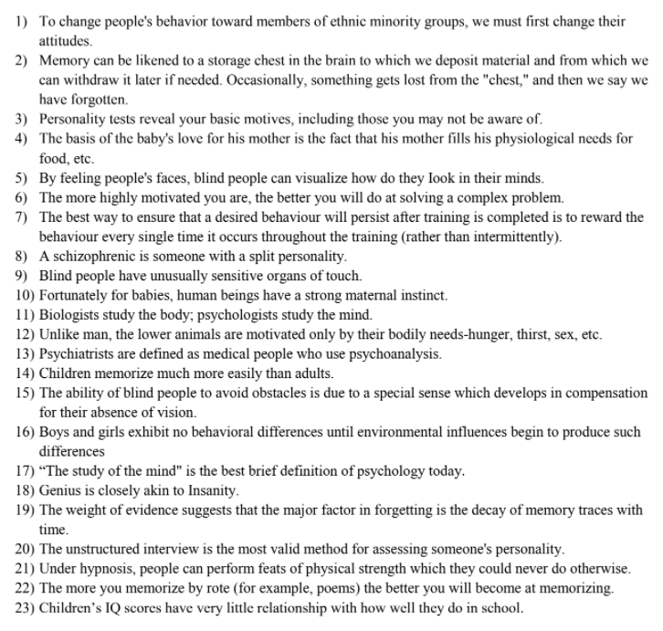

## What is Psychology? 
* Psychology is the science of **behaviour** and the **mind**; it includes the application of the **science** to solve human problems.
* Unconscious knowledge are operations that are stored in your mind and helps to organise and react to information
* Subconscious thoughts: Driving a two-wheeler
* Science is the process of gaining knowledge through observation and experimentation 
## Why is it necessary to study psychology? 
* All of these statements are **False**
* 
* We do not understand situations that we are using in our everyday life
## Schools of Psychology 
* Structuralism 
  * You break down anything to it's constituent elements 
  * To study mind, we break it down into smaller parts (through introspection)
  * Introspection: Objectively examine your thoughts and break it down 
  ### Problem with this method
  * It does not tell us how mind functions, even if we have broken it down to it's elements
  
