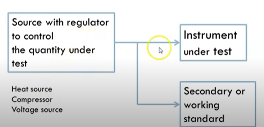
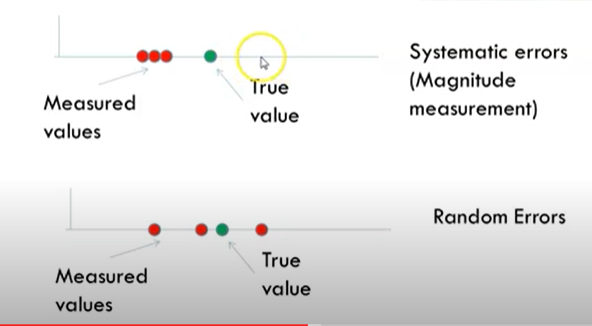

## What is error?
* Difference between measured and the true value
* Usually in percentage
$$
Err=(Measured-True)*100/True
$$
* Accuracy is the confirmity of the measurement of the true value
## What is a True value? 
* True value that is measured by the instrument without error 
* But this does not exist
* But, highly accurate primary standards are available; but they are rare and expensive
* Less accurate secondary standard are available
* **Working standards** are used in industries 
## Calibration procedure

* Source => mesaurement with Instrument under test and working standard simualtaneously
* Check if the error is tolerable
* Test over the entire full scale (ideally infinite)
* Validate the accuracy
## Types of Measurement errors
* Systematic errors
  * Due to instrument inaccuracies
    * The error is usually consistent
  * Faulty design of an experiment 
    * You have to put a filter and there is a problem with filter gain 
  * These errors are repeatable 

* Random errors
  * Human error
    * You read _1.23V instead of 1.32V _
    * This is going to be quite random 

  * Noise 
    * This is quite random too
  * These errors are not repeatable

## How to tackle errors? 
* Take many values and average to reduce the effect of random errors

## Standard error
* Likely discrepancy in sample mean and population mean 
* Standard deviation measures dispersion to the data set relative to its mean 
  $$ SD=\sqrt{{\displaystyle\sum_{i=1}^{n\scriptscriptstyle x}(x{\scriptscriptstyle li}-x{\scriptscriptstyle l})^2}/n{\scriptscriptstyle x}-1 }
  $$

* Divided by nx-1 as we are taking finite readings, x1 is not a true mean but an estimate
* Standard error is proportional to SD
* Larger the n, lower the SD, closer is the mean to it's true value 
* $$
SE=SD/{\sqrt{n{\scriptscriptstyle x}}}
$$ 
Where nx is the number of readings that you have taken  

# Summary 
 _Error is the difference between measured and true value - True value is measured without error (primary, secondary and working standards) - Source measured simultaneously under working standard and instrument under test to validate accuracy - Systematic errors (Inst inaccuracies, faulty design, repeatable) and Random errors (Human error, noise and not repeatable) are the types of errors - Errors are tackled by calculating the mean of many values - Standard error gives likely discrepancy - Related to SD (root(sigma(xli-xl)^2)/(nx-1)), nx-1 in SD as xl is not the true mean - SE=SD/root(nx)_